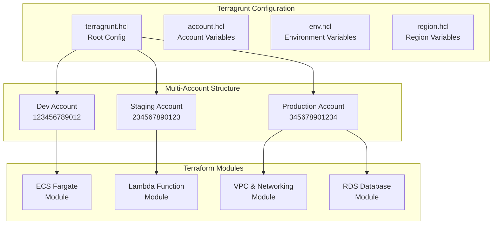

# Infrastructure as Code

> **Enterprise-grade Terraform modules and Terragrunt patterns for multi-cloud, multi-environment deployments**

This section demonstrates production-ready Infrastructure as Code practices using Terraform and Terragrunt, showcasing patterns used to manage infrastructure across multiple AWS accounts and environments.

## 🏗️ Architecture Overview



## 📁 Structure

```
1-infrastructure-as-code/
├── terragrunt-config/              # Multi-environment configuration
│   ├── terragrunt.hcl             # Root Terragrunt configuration
│   ├── account.hcl.example        # Account-level variables
│   ├── env.hcl.example            # Environment-level variables
│   └── region.hcl.example         # Region-level variables
├── terraform-modules/             # Reusable Terraform modules
│   ├── ecs-fargate/               # ECS Fargate service module
│   ├── lambda-function/           # Containerized Lambda module
│   ├── vpc-networking/            # VPC with security groups
│   └── rds-postgres/              # RDS with encryption
├── examples/                      # Working deployment examples
│   ├── web-application/           # Full web app stack
│   └── ml-pipeline/               # ML workload infrastructure
└── docs/                         # Additional documentation
    ├── DEPLOYMENT.md              # Deployment guide
    ├── SECURITY.md                # Security best practices
    └── TROUBLESHOOTING.md         # Common issues & solutions
```

## 🎯 Key Features

### **Multi-Environment Management**
- **Terragrunt DRY patterns**: Single module definitions, environment-specific configurations
- **Remote state isolation**: Separate state files per environment/region
- **Account-level security**: Cross-account deployment with proper IAM boundaries

### **Production-Ready Modules**
- **ECS Fargate**: Auto-scaling web services with load balancing
- **Lambda Functions**: Containerized serverless functions with VPC integration
- **VPC Networking**: Multi-AZ setup with public/private subnets
- **RDS Databases**: Encrypted databases with automated backups

### **Security Best Practices**
- **Least privilege IAM**: Role-based access with minimal permissions
- **Encryption everywhere**: KMS encryption for data at rest and in transit
- **Network isolation**: Private subnets, security groups, NACLs
- **Secrets management**: Integration with AWS Systems Manager Parameter Store

### **Cost Optimization**
- **Resource tagging**: Automatic tagging for cost allocation
- **Right-sizing**: Instance types optimized for workload requirements
- **Lifecycle policies**: Automated cleanup of unused resources

## 🚀 Quick Start

### Prerequisites
```bash
# Install required tools
brew install terraform terragrunt awscli
```

### 1. Configure AWS Credentials
```bash
# Set up AWS profiles for different accounts
aws configure --profile dev-account
aws configure --profile prod-account
```

### 2. Customize Configuration
```bash
# Copy and customize environment files
cp terragrunt-config/account.hcl.example terragrunt-config/account.hcl
cp terragrunt-config/env.hcl.example terragrunt-config/env.hcl
```

### 3. Deploy Infrastructure
```bash
# Deploy to development environment
cd examples/web-application/dev
terragrunt plan
terragrunt apply

# Deploy to production environment  
cd ../prod
terragrunt plan
terragrunt apply
```

## 📊 Module Documentation

### [ECS Fargate Module](./terraform-modules/ecs-fargate/)
- **Purpose**: Deploy containerized applications with auto-scaling
- **Features**: Application Load Balancer, Service Discovery, CloudWatch logging
- **Use Case**: Web applications, APIs, microservices

### [Lambda Function Module](./terraform-modules/lambda-function/)
- **Purpose**: Deploy containerized Lambda functions
- **Features**: VPC integration, environment variables, event triggers
- **Use Case**: Event processing, scheduled tasks, API backends

### [VPC Networking Module](./terraform-modules/vpc-networking/)
- **Purpose**: Create secure, multi-AZ network infrastructure
- **Features**: Public/private subnets, NAT gateways, security groups
- **Use Case**: Foundation for all other resources

## 🔐 Security Considerations

- **State file encryption**: All Terraform state files are encrypted in S3
- **DynamoDB locking**: Prevents concurrent modifications
- **IAM boundaries**: Each environment has isolated permissions
- **KMS key management**: Separate keys per environment
- **VPC isolation**: Network-level separation between environments

## 💰 Cost Management

- **Resource tagging**: Automatic cost allocation tags
- **Environment sizing**: Different instance types per environment
- **Lifecycle management**: Automatic cleanup policies
- **Monitoring**: CloudWatch cost alarms and budgets

## 🔄 CI/CD Integration

This infrastructure supports automated deployments via:
- **GitHub Actions**: Terraform plan/apply workflows
- **Branch protection**: Required reviews for production changes
- **Drift detection**: Automated detection of configuration drift
- **Rollback capabilities**: Infrastructure versioning and rollback

---

**Next Steps**: Explore the [Container Orchestration](../2-container-orchestration/) section to see how applications are deployed on this infrastructure. 