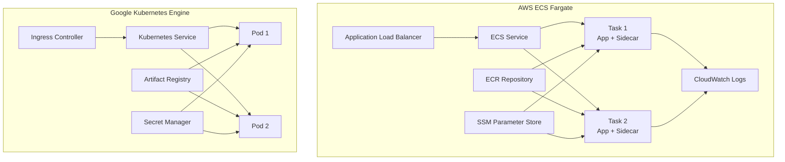

# Container Orchestration

> **Production-ready container deployment patterns for AWS ECS Fargate and Kubernetes**

This section demonstrates enterprise-grade container orchestration practices, showcasing patterns used to deploy and manage containerized applications at scale across multiple cloud platforms.

## 🏗️ Architecture Overview



## 📁 Structure

```
2-container-orchestration/
├── aws-ecs-fargate/               # Amazon ECS Fargate deployments
│   ├── task-definitions/          # ECS task definitions
│   │   ├── web-application.json   # Multi-container web app
│   │   └── ml-processor.json      # AI/ML batch processor
│   ├── terraform/                 # ECS infrastructure as code
│   │   ├── main.tf               # ECS cluster and services
│   │   ├── variables.tf          # Input variables
│   │   └── outputs.tf            # Output values
│   └── examples/                  # Working deployment examples
├── kubernetes-gke/                # Google Kubernetes Engine
│   ├── manifests/                # Kubernetes YAML manifests
│   │   ├── web-app/              # Web application deployment
│   │   ├── ml-pipeline/          # ML batch processing jobs
│   │   └── vector-db/            # Qdrant vector database
│   ├── helm-charts/              # Helm chart templates
│   │   ├── web-application/      # Web app Helm chart
│   │   └── ml-workload/          # ML workload Helm chart
│   └── helmfile/                 # Environment-specific deployments
├── docker/                       # Container configurations
│   ├── web-application/          # Next.js web app Dockerfile
│   ├── ml-crawler/               # Python crawler Dockerfile
│   └── best-practices/           # Docker security & optimization
└── docs/                         # Additional documentation
    ├── ECS-DEPLOYMENT.md         # ECS deployment guide
    ├── K8S-DEPLOYMENT.md         # Kubernetes deployment guide
    └── SECURITY.md               # Container security practices
```

## 🎯 Key Features

### **Multi-Container Applications**
- **ECS Task Definitions**: Multi-container tasks with sidecar patterns
- **Kubernetes Pods**: Application and utility containers
- **Service Mesh**: Container-to-container communication patterns
- **Shared Volumes**: Data sharing between containers

### **Secrets Management**
- **AWS**: SSM Parameter Store and Secrets Manager integration
- **GCP**: Secret Manager with CSI driver
- **Kubernetes**: Native secrets with external-secrets operator
- **Environment Isolation**: Per-environment secret management

### **Auto-Scaling & Load Balancing**
- **ECS**: Application Auto Scaling with CloudWatch metrics
- **Kubernetes**: HPA (Horizontal Pod Autoscaler) and VPA
- **Load Balancing**: ALB for ECS, Ingress controllers for K8s
- **Blue-Green Deployments**: Zero-downtime deployment strategies

### **Monitoring & Observability**
- **Logging**: Centralized logging with CloudWatch and Stackdriver
- **Metrics**: Custom metrics collection and alerting
- **Tracing**: Distributed tracing for microservices
- **Health Checks**: Application and infrastructure health monitoring

## 🚀 Production Patterns

### **Document Processing Pipeline**
Real-world example from production environment processing 250K+ documents:

```yaml
# ECS Task Definition Pattern
{
  "family": "document-processor",
  "containerDefinitions": [
    {
      "name": "main-app",
      "image": "account.dkr.ecr.region.amazonaws.com/doc-processor:latest",
      "secrets": [
        {
          "name": "OPENAI_API_KEY",
          "valueFrom": "arn:aws:ssm:region:account:parameter/app/openai-key"
        }
      ]
    },
    {
      "name": "doc-builder",
      "image": "account.dkr.ecr.region.amazonaws.com/doc-builder:latest",
      "essential": true
    }
  ]
}
```

### **AI/ML Batch Processing**
Kubernetes CronJob pattern for scheduled ML workloads:

```yaml
apiVersion: batch/v1
kind: CronJob
metadata:
  name: ml-batch-processor
spec:
  schedule: "0 2 * * *"  # Daily at 2 AM
  jobTemplate:
    spec:
      template:
        spec:
          containers:
          - name: processor
            image: gcr.io/project/ml-processor:latest
            resources:
              requests:
                memory: "2Gi"
                cpu: "1000m"
              limits:
                memory: "4Gi"
                cpu: "2000m"
```

## 🔐 Security Best Practices

### **Container Security**
- **Image Scanning**: Vulnerability scanning in ECR and GAR
- **Least Privilege**: Non-root containers with minimal permissions
- **Network Policies**: Kubernetes network policies for traffic control
- **Secret Rotation**: Automated secret rotation patterns

### **Runtime Security**
- **Security Contexts**: Proper security contexts and capabilities
- **Pod Security Standards**: Kubernetes PSS enforcement
- **Resource Limits**: CPU and memory limits to prevent resource exhaustion
- **Image Policies**: Only signed and verified images

## 💰 Cost Optimization

### **Resource Management**
- **Right-Sizing**: Appropriate CPU and memory allocation
- **Spot Instances**: ECS and GKE spot instance usage
- **Auto-Scaling**: Demand-based scaling to minimize costs
- **Resource Quotas**: Kubernetes resource quotas and limits

### **Efficiency Patterns**
- **Multi-Stage Builds**: Optimized Docker images
- **Image Caching**: Layer caching for faster builds
- **Cluster Autoscaling**: Node-level auto-scaling
- **Reserved Capacity**: Long-term workload optimization

## 🔄 CI/CD Integration

### **GitHub Actions Workflows**
- **ECS Deployment**: Blue-green deployments with CodeDeploy
- **GKE Deployment**: GitOps with ArgoCD integration
- **Multi-Environment**: Automated promotion pipelines
- **Rollback Strategies**: Automated rollback on failure

### **GitOps Patterns**
- **Helm**: Environment-specific value files
- **Kustomize**: Configuration management
- **ArgoCD**: Continuous deployment
- **Policy as Code**: OPA/Gatekeeper policies

## 📊 Monitoring & Alerting

### **Observability Stack**
- **Metrics**: Prometheus, CloudWatch, Stackdriver
- **Logging**: Fluentd, CloudWatch Logs, Stackdriver Logging
- **Tracing**: Jaeger, AWS X-Ray, Cloud Trace
- **Alerting**: AlertManager, CloudWatch Alarms, Cloud Monitoring

### **SLI/SLO Monitoring**
- **Availability**: Service uptime and health checks
- **Latency**: Response time monitoring
- **Error Rates**: Application error tracking
- **Throughput**: Request volume and processing rates

---

**Next Steps**: 
- [AWS ECS Fargate →](./aws-ecs-fargate/) - Production ECS task definitions and infrastructure
- [Kubernetes GKE →](./kubernetes-gke/) - Kubernetes manifests and Helm charts
- [Docker Configurations →](./docker/) - Optimized container images and security practices 