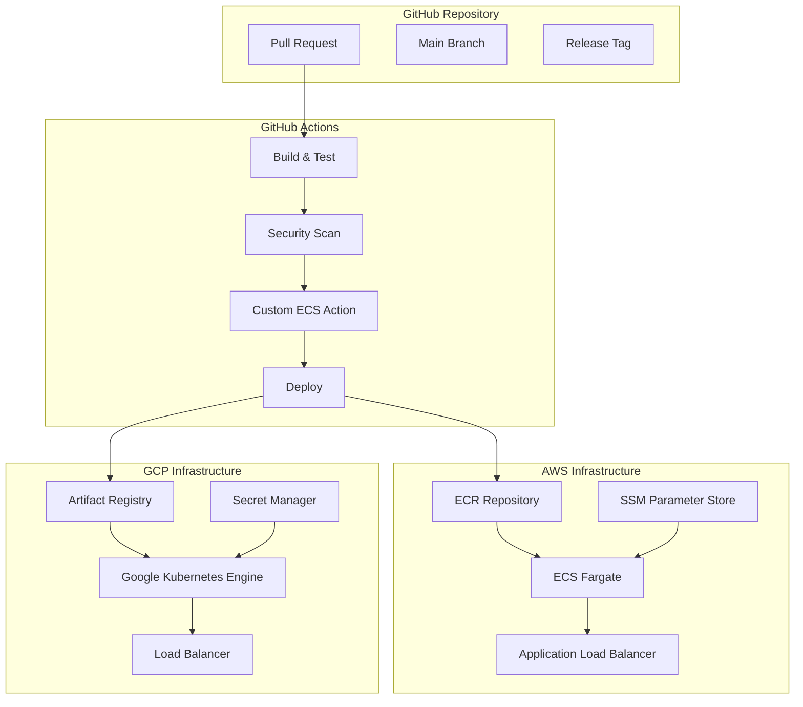

# CI/CD Pipelines

> **Production-ready GitHub Actions workflows for multi-cloud container deployments**

This section demonstrates enterprise-grade CI/CD practices using GitHub Actions, showcasing automated deployment pipelines for both AWS ECS Fargate and Google Kubernetes Engine, with custom actions for advanced ECS task definition management.

## 🏗️ Pipeline Architecture



## 📁 Structure

```
3-cicd-pipelines/
├── github-actions/                    # GitHub Actions workflows
│   ├── aws-ecs-deployment.yml        # ECS Fargate deployment pipeline
│   ├── gcp-gke-deployment.yml        # GKE deployment pipeline
│   ├── multi-environment.yml         # Multi-environment promotion pipeline
│   └── security-scanning.yml         # Security and quality gates
├── custom-actions/                   # Custom GitHub Actions
│   ├── aws-taskdef-action/           # ECS task definition management
│   │   ├── action.yml               # Action definition
│   │   ├── index.js                 # Main implementation
│   │   ├── package.json             # Dependencies
│   │   └── README.md                # Usage documentation
│   └── shared-workflows/             # Reusable workflows
├── deployment-configs/               # Deployment configurations
│   ├── service-configs/              # Service-specific configurations
│   │   ├── web-app.yml              # Web application config
│   │   └── ml-pipeline.yml          # ML pipeline config
│   └── environments/                 # Environment-specific settings
│       ├── dev.yml                  # Development environment
│       ├── staging.yml              # Staging environment
│       └── prod.yml                 # Production environment
└── docs/                            # Pipeline documentation
    ├── DEPLOYMENT-GUIDE.md          # Step-by-step deployment guide
    ├── SECURITY-PRACTICES.md        # Security best practices
    └── TROUBLESHOOTING.md           # Common issues and solutions
```

## 🎯 Key Features

### **Multi-Cloud Deployment Pipelines**
- **AWS ECS Fargate**: Automated container deployment with blue-green strategies
- **Google Kubernetes Engine**: GitOps-style deployments with Helm
- **Cross-cloud consistency**: Unified pipeline patterns across platforms
- **Environment promotion**: Automated promotion from dev → staging → prod

### **Advanced ECS Integration**
- **Custom GitHub Action**: Automated SSM parameter injection into task definitions
- **Dynamic secrets management**: Wildcard SSM parameter resolution
- **Multi-container support**: Sidecar pattern deployments
- **Datadog integration**: Automated monitoring agent injection
- **Builder containers**: Dynamic utility container injection

### **Security & Quality Gates**
- **Container scanning**: Vulnerability scanning with Trivy and Snyk
- **SAST/DAST**: Static and dynamic application security testing
- **Policy enforcement**: OPA/Gatekeeper policies for Kubernetes
- **Secret scanning**: Automated detection of exposed secrets
- **Compliance checks**: SOC2 and ISO 27001 alignment

### **Production-Ready Features**
- **Blue-green deployments**: Zero-downtime deployment strategies
- **Rollback capabilities**: Automated rollback on failure detection
- **Approval workflows**: Manual approval gates for production
- **Monitoring integration**: Automated monitoring setup and alerting
- **Cost optimization**: Resource tagging and cost allocation

## 🚀 Custom ECS Action Features

Our custom `aws-taskdef-action` provides advanced ECS task definition management:

### **Dynamic Secret Injection**
```yaml
- name: Inject Secrets to Task Definition
  uses: ./custom-actions/aws-taskdef-action
  with:
    task-definition: task-definition.json
    container-name: web-app
    config-path: deployment-configs/service-configs/web-app.yml
    environment: production
```

### **Key Capabilities**
- **Wildcard SSM Parameters**: Automatically inject all parameters under a path
- **Multi-container Support**: Chain multiple containers in single task definition
- **Environment-specific Configuration**: Dynamic configuration based on environment
- **Datadog Agent Injection**: Automated monitoring sidecar injection
- **Builder Container Support**: Dynamic utility container management
- **Resource Optimization**: CPU and memory configuration per environment

## 🔄 Deployment Workflows

### **AWS ECS Pipeline**
```yaml
name: Deploy to AWS ECS
on:
  push:
    branches: [main]
  
jobs:
  deploy:
    runs-on: ubuntu-latest
    steps:
    - uses: actions/checkout@v4
    
    - name: Configure AWS credentials
      uses: aws-actions/configure-aws-credentials@v4
      with:
        role-to-assume: ${{ secrets.AWS_ROLE_ARN }}
        aws-region: us-east-1
    
    - name: Build and push image
      run: |
        docker build -t $ECR_REGISTRY/$ECR_REPOSITORY:$GITHUB_SHA .
        docker push $ECR_REGISTRY/$ECR_REPOSITORY:$GITHUB_SHA
    
    - name: Inject secrets to task definition
      uses: ./custom-actions/aws-taskdef-action
      with:
        task-definition: task-definition.json
        container-name: web-app
        config-path: deployment-configs/service-configs/web-app.yml
        environment: production
    
    - name: Deploy to ECS
      uses: aws-actions/amazon-ecs-deploy-task-definition@v1
      with:
        task-definition: ${{ steps.inject-secrets.outputs.task-definition }}
        service: web-app-service
        cluster: production-cluster
```

### **GKE Pipeline**
```yaml
name: Deploy to GKE
on:
  push:
    branches: [main]

jobs:
  deploy:
    runs-on: ubuntu-latest
    steps:
    - uses: actions/checkout@v4
    
    - name: Authenticate to Google Cloud
      uses: google-github-actions/auth@v2
      with:
        credentials_json: ${{ secrets.GCP_SA_KEY }}
    
    - name: Build and push to GAR
      run: |
        docker build -t $GAR_LOCATION/$PROJECT_ID/$REPOSITORY/$IMAGE:$GITHUB_SHA .
        docker push $GAR_LOCATION/$PROJECT_ID/$REPOSITORY/$IMAGE:$GITHUB_SHA
    
    - name: Deploy to GKE
      run: |
        gcloud container clusters get-credentials $GKE_CLUSTER --region $GKE_REGION
        helm upgrade --install web-app ./helm-charts/web-application \
          --set image.tag=$GITHUB_SHA \
          --set environment=production
```

## 🔐 Security Best Practices

### **Secrets Management**
- **AWS**: IAM roles with OIDC, no long-lived credentials
- **GCP**: Workload Identity Federation for secure authentication
- **Kubernetes**: External Secrets Operator with cloud secret managers
- **GitHub**: Encrypted secrets with environment-specific access

### **Supply Chain Security**
- **SBOM Generation**: Software Bill of Materials for all builds
- **Signed Containers**: Cosign integration for container signing
- **Policy Enforcement**: Admission controllers for security policies
- **Vulnerability Management**: Continuous scanning and remediation

### **Compliance & Governance**
- **Audit Trails**: Complete deployment history and approvals
- **Policy as Code**: Automated compliance checking
- **Access Controls**: RBAC for deployment permissions
- **Change Management**: Automated change documentation

## 💰 Cost Optimization

### **Resource Management**
- **Dynamic Scaling**: Auto-scaling based on metrics
- **Spot Instances**: Cost-effective compute for non-critical workloads
- **Resource Tagging**: Automated cost allocation and tracking
- **Environment Cleanup**: Automated cleanup of temporary resources

### **Pipeline Efficiency**
- **Caching**: Docker layer caching and dependency caching
- **Parallel Execution**: Concurrent builds and deployments
- **Resource Limits**: Efficient resource allocation for runners
- **Scheduled Operations**: Off-hours deployments for cost savings

## 📊 Monitoring & Observability

### **Pipeline Monitoring**
- **Deployment Metrics**: Success rates, duration, frequency
- **Error Tracking**: Automated error detection and alerting
- **Performance Monitoring**: Build and deployment performance
- **Cost Tracking**: Pipeline execution costs and optimization

### **Application Monitoring**
- **Health Checks**: Automated health monitoring post-deployment
- **Performance Metrics**: Application performance tracking
- **Log Aggregation**: Centralized logging and analysis
- **Alerting**: Automated incident detection and response

## 🔄 GitOps Integration

### **Infrastructure as Code**
- **Terraform**: Infrastructure provisioning and management
- **Helm**: Kubernetes application deployment
- **ArgoCD**: Continuous deployment for Kubernetes
- **Flux**: GitOps operator for automated synchronization

### **Configuration Management**
- **Environment Parity**: Consistent configurations across environments
- **Secret Rotation**: Automated secret rotation and updates
- **Drift Detection**: Automated detection of configuration drift
- **Rollback Strategies**: Quick rollback capabilities

---

**Next Steps**: 
- [AWS ECS Deployment →](./github-actions/aws-ecs-deployment.yml) - Complete ECS deployment pipeline
- [GKE Deployment →](./github-actions/gcp-gke-deployment.yml) - Kubernetes deployment pipeline  
- [Custom ECS Action →](./custom-actions/aws-taskdef-action/) - Advanced task definition management 