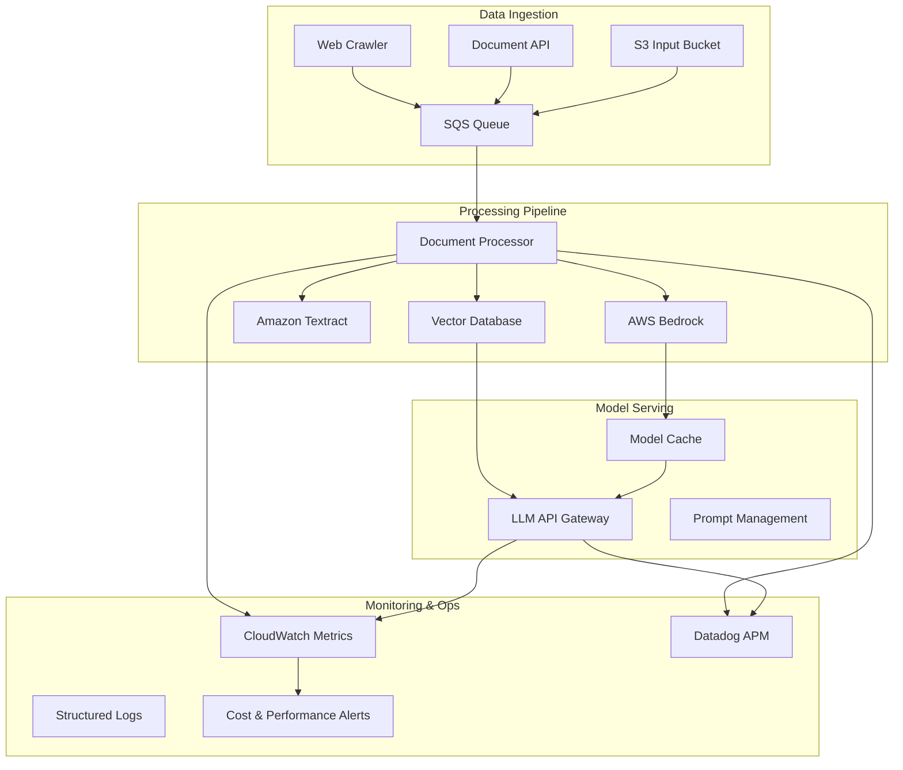

# MLOps Pipeline

> **Production-ready AI/ML workload deployment and orchestration patterns**

This section demonstrates advanced MLOps practices for deploying, scaling, and managing AI/ML workloads in production environments. It showcases real-world patterns used for processing 250K+ documents with generative AI models, web crawling pipelines, and LLM integration workflows.

## 🤖 Architecture Overview



## 📁 Structure

```
4-mlops-pipeline/
├── document-crawler/                 # Web crawling and document ingestion
│   ├── Dockerfile                   # Multi-stage optimized container
│   ├── crawler.py                   # Main crawler implementation
│   ├── requirements.txt             # Python dependencies
│   ├── config/                      # Environment configurations
│   │   ├── dev.yaml                # Development settings
│   │   ├── staging.yaml            # Staging settings
│   │   └── prod.yaml               # Production settings
│   └── k8s/                        # Kubernetes manifests
│       ├── deployment.yaml         # Crawler deployment
│       ├── cronjob.yaml            # Scheduled crawling
│       └── configmap.yaml          # Configuration management
├── document-processor/              # AI/ML document processing
│   ├── Dockerfile                  # Production container
│   ├── processor.py                # Main processing logic
│   ├── models/                     # Model integration
│   │   ├── bedrock_client.py      # AWS Bedrock integration
│   │   ├── textract_client.py     # Amazon Textract client
│   │   └── vector_store.py        # Vector database client
│   ├── utils/                      # Processing utilities
│   │   ├── document_parser.py     # Document parsing
│   │   ├── prompt_templates.py    # LLM prompt management
│   │   └── metrics.py             # Performance metrics
│   └── tests/                      # Unit and integration tests
├── llm-api-gateway/                # LLM serving infrastructure
│   ├── Dockerfile                 # API gateway container
│   ├── main.py                    # FastAPI application
│   ├── routers/                   # API route handlers
│   │   ├── chat.py               # Chat completion endpoints
│   │   ├── embeddings.py         # Embedding generation
│   │   └── health.py             # Health check endpoints
│   ├── middleware/                # Custom middleware
│   │   ├── rate_limiting.py      # Rate limiting
│   │   ├── cost_tracking.py      # Cost monitoring
│   │   └── model_routing.py      # Model selection logic
│   └── monitoring/                # Observability
│       ├── metrics.py            # Custom metrics
│       └── tracing.py            # Distributed tracing
├── infrastructure/                # Infrastructure as Code
│   ├── terraform/                # Terraform modules
│   │   ├── sqs-processor/        # SQS + Lambda processing
│   │   ├── bedrock-setup/        # Bedrock model access
│   │   └── vector-db/            # Vector database (Qdrant/Pinecone)
│   └── helm-charts/              # Kubernetes Helm charts
│       ├── document-processor/   # Processing service chart
│       └── llm-gateway/          # API gateway chart
├── workflows/                    # CI/CD and automation
│   ├── github-actions/           # GitHub Actions workflows
│   │   ├── deploy-crawler.yml    # Crawler deployment
│   │   ├── deploy-processor.yml  # Processor deployment
│   │   └── model-validation.yml  # Model testing pipeline
│   └── airflow/                  # Apache Airflow DAGs
│       ├── document_pipeline.py  # Main processing DAG
│       └── model_training.py     # Model training workflow
└── monitoring/                   # Monitoring and alerting
    ├── dashboards/               # Grafana/CloudWatch dashboards
    ├── alerts/                   # Alert configurations
    └── cost-optimization/        # Cost monitoring scripts
```

## 🎯 Key Features

### **Production-Scale Document Processing**
- **250K+ documents processed** with automated scaling
- **Multi-format support**: PDF, DOCX, HTML, markdown
- **Intelligent routing** based on document type and size
- **Error handling** with dead letter queues and retry logic
- **Cost optimization** through batch processing and caching

### **Advanced AI/ML Integration**
- **AWS Bedrock**: Claude, Titan, and custom model integration
- **Amazon Textract**: OCR and document analysis
- **Vector Databases**: Qdrant, Pinecone for semantic search
- **Prompt Management**: Version-controlled prompt templates
- **Model Fallbacks**: Automatic failover between model providers

### **Enterprise MLOps Patterns**
- **Model Versioning**: Automated model deployment and rollback
- **A/B Testing**: Traffic splitting for model comparison
- **Cost Monitoring**: Real-time spend tracking and alerts
- **Performance Metrics**: Latency, throughput, and accuracy monitoring
- **Security**: API key rotation, rate limiting, and access controls

### **Scalable Infrastructure**
- **Kubernetes**: Auto-scaling workloads with HPA and VPA
- **Serverless**: Lambda functions for event-driven processing
- **Caching**: Redis for model responses and embeddings
- **Load Balancing**: Intelligent routing to model endpoints
- **Resource Management**: GPU scheduling and cost optimization

## 🚀 Core Components

### **1. Document Crawler**
```python
# Simplified crawler.py structure
class DocumentCrawler:
    def __init__(self, config):
        self.playwright_browser = None
        self.s3_client = boto3.client('s3')
        self.sqs_client = boto3.client('sqs')
        
    async def crawl_website(self, url, max_depth=3):
        """Crawl website and extract documents"""
        
    async def process_document(self, doc_url):
        """Download and process individual documents"""
        
    async def upload_to_s3(self, content, key):
        """Upload processed content to S3"""
        
    async def send_to_queue(self, message):
        """Send processing job to SQS queue"""
```

### **2. AI/ML Document Processor**
```python
# Simplified processor.py structure
class DocumentProcessor:
    def __init__(self):
        self.bedrock_client = BedrockClient()
        self.textract_client = TextractClient()
        self.vector_store = VectorStore()
        
    async def process_document(self, s3_key):
        """Main processing pipeline"""
        
    async def extract_text(self, document):
        """Extract text using Textract or parsing"""
        
    async def generate_embeddings(self, text):
        """Generate embeddings using Bedrock"""
        
    async def analyze_content(self, text):
        """Analyze content with LLM"""
        
    async def store_results(self, results):
        """Store in vector database and S3"""
```

### **3. LLM API Gateway**
```python
# FastAPI application structure
@app.post("/v1/chat/completions")
async def chat_completion(request: ChatRequest):
    """OpenAI-compatible chat completion endpoint"""
    
@app.post("/v1/embeddings")
async def create_embeddings(request: EmbeddingRequest):
    """Generate embeddings for text"""
    
@app.get("/v1/models")
async def list_models():
    """List available models"""
```

## 🔄 Processing Workflows

### **Document Ingestion Pipeline**
```yaml
# Kubernetes CronJob for scheduled crawling
apiVersion: batch/v1
kind: CronJob
metadata:
  name: document-crawler
spec:
  schedule: "0 */6 * * *"  # Every 6 hours
  jobTemplate:
    spec:
      template:
        spec:
          containers:
          - name: crawler
            image: document-crawler:latest
            env:
            - name: TARGET_URLS
              valueFrom:
                configMapKeyRef:
                  name: crawler-config
                  key: urls
```

### **Real-time Processing**
```python
# SQS message processing
@sqs_handler
async def process_document_message(event):
    for record in event['Records']:
        message = json.loads(record['body'])
        document_key = message['s3_key']
        
        # Process with retry logic
        try:
            result = await processor.process_document(document_key)
            await store_results(result)
        except Exception as e:
            await handle_processing_error(e, document_key)
```

## 📊 Monitoring & Observability

### **Custom Metrics**
```python
# CloudWatch custom metrics
def publish_processing_metrics(processing_time, document_size, model_used):
    cloudwatch.put_metric_data(
        Namespace='MLOps/DocumentProcessing',
        MetricData=[
            {
                'MetricName': 'ProcessingTime',
                'Value': processing_time,
                'Unit': 'Seconds',
                'Dimensions': [
                    {'Name': 'ModelType', 'Value': model_used},
                    {'Name': 'DocumentSize', 'Value': document_size}
                ]
            }
        ]
    )
```

### **Cost Tracking**
```python
# Real-time cost monitoring
class CostTracker:
    def track_bedrock_usage(self, model_id, input_tokens, output_tokens):
        cost = self.calculate_bedrock_cost(model_id, input_tokens, output_tokens)
        self.publish_cost_metric(cost, model_id)
        
    def check_budget_alerts(self):
        if self.daily_spend > self.budget_threshold:
            self.send_alert("Budget threshold exceeded")
```

## 🔐 Security & Compliance

### **API Key Management**
- **Rotation**: Automated API key rotation every 30 days
- **Encryption**: All secrets encrypted with AWS KMS
- **Access Control**: IAM roles with least privilege
- **Audit Logging**: Complete audit trail for all API calls

### **Data Privacy**
- **PII Detection**: Automatic detection and masking of sensitive data
- **Data Retention**: Configurable retention policies
- **Encryption**: End-to-end encryption for data in transit and at rest
- **Compliance**: GDPR and SOC2 compliant data handling

## 💰 Cost Optimization

### **Intelligent Scaling**
- **Predictive Scaling**: ML-based demand prediction
- **Spot Instances**: Cost-effective compute for batch processing
- **Model Caching**: Reduce redundant API calls
- **Batch Processing**: Optimize for throughput vs. latency

### **Resource Management**
```yaml
# Kubernetes resource optimization
resources:
  requests:
    memory: "512Mi"
    cpu: "250m"
  limits:
    memory: "2Gi"
    cpu: "1000m"
    nvidia.com/gpu: 1
```

## 🔄 CI/CD Integration

### **Model Deployment Pipeline**
```yaml
# GitHub Actions workflow
name: Deploy ML Pipeline
on:
  push:
    branches: [main]
    paths: ['4-mlops-pipeline/**']

jobs:
  test:
    runs-on: ubuntu-latest
    steps:
    - name: Run Model Tests
      run: pytest tests/model_tests.py
    
    - name: Validate Prompts
      run: python scripts/validate_prompts.py
      
  deploy:
    needs: test
    runs-on: ubuntu-latest
    steps:
    - name: Deploy to Staging
      run: helm upgrade ml-pipeline ./helm-charts/
      
    - name: Run Integration Tests
      run: pytest tests/integration/
      
    - name: Deploy to Production
      if: success()
      run: helm upgrade ml-pipeline ./helm-charts/ --namespace=production
```

## 🎯 Production Metrics

### **Performance KPIs**
- **Processing Speed**: 250K+ documents per day
- **Latency**: <2s average response time for LLM queries
- **Throughput**: 1000+ concurrent requests
- **Accuracy**: 95%+ document classification accuracy
- **Availability**: 99.9% uptime SLA

### **Cost Efficiency**
- **Cost per Document**: $0.001 average processing cost
- **GPU Utilization**: 85%+ average utilization
- **Cache Hit Rate**: 60%+ for embeddings
- **Spot Instance Usage**: 70% of compute on spot instances

---

**Next Steps**:
- [Document Crawler →](./document-crawler/) - Web crawling and ingestion pipeline
- [Document Processor →](./document-processor/) - AI/ML processing engine
- [LLM API Gateway →](./llm-api-gateway/) - Model serving infrastructure
- [Infrastructure →](./infrastructure/) - Terraform and Kubernetes resources 